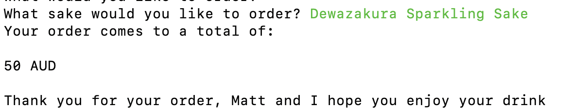
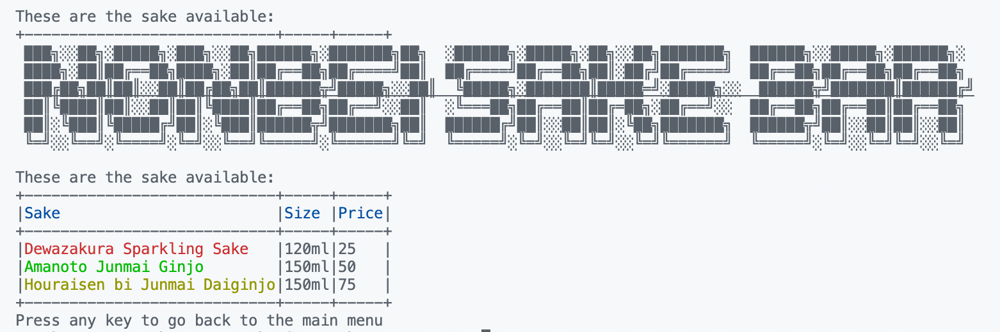

# **Nonbei - Sake bar**

**Source Control Repository:** https://github.com/mattty-t/nonbei_sake_bar

## **Software Development plan** 

**Purpose of the application**

The purpose of this Terminal application was to develop an application where it allows Users to be able to purchase drinks, pay for their bill and learn more about sake (alcohol). The target audience is for people who love drinking and want to know more about sake.

## **Walkthrough**

Upon starting the application. The application will get user input and prompt the user to answer a few questions: 


---

If the user does not answer it correctly, it will print a message for the User to enter the required information and if not, it will exit.


After that, it will ask the user to input their name and if they do not input their name, the terminal application will exit.


---

Once all the information has been asked. The user will be directed to the main menu. As seen below, users use the up/arrow keys to move and enter to input their selection. I used TTY prompt to stop any User Input errors. 


---

If the User selects "View the Menu", it will take them to the screen with the Sake Menu using TTY-tables. A feature I would have liked to add in the future is for the user to press any key and for it to take them back. Unfortunately, the User has to restart the app again to go back to the main menu which makes it not user friendly.


---

If the User selects "View Sake Information". It will populate a TTY-prompt with which sake they would like to view.


Selecting the sake they want to know about, will take them to the page with the information. It will display information about the sake. Unfortunately, the User needs to restart the app again. Which makes it not a very user friendly experience. For the future, I would like a feature where the user can go back or return to menu.


---

Selecting Order a Drink will populate a screen where it allows the user to choose what they want to order. 


It will print the total. In the future, I would like to be able to add extra details such as how they want the sake served, what size they want and the quantity. 




---
## **Features** 

**TTY-table**



I have used TTY-table to create a menu when the user selects "View the Menu". A method I wanted to do was for the user to be able to press any key and for it to go back to the menu. Users will have to restart the app again if they want to "Order a Drink" and "View Sake Information".  Colorize was used to make the table a bit more aesthetically. 


**TTY prompt**


This feature allows the user to use the up/down arrow key and enter to select the options available. I have used this feature for when the user chooses "Order a drink" and also "View Sake Information"

**User interface**

I have used ascii to create the title for the bar and on the screens. I also used colorize to make the terminal application more visually appealing.

---

## **Control flow of diagram**

Below is the Control Flow Diagram I started with and the features I wanted to do with it.


**Prototype Control Flow Diagram**


Below is the Control Flow Diagram I ended up doing. I was not able to do the features I wanted to in the Prototype Control Flow Diagram.

**Final Control Flow Diagram**


---

## **Code**

**Class/Objects**

Sake Class that was created to store the sake details/objects/variables.


**Case Statements and TTY prompt**


**If/else statements**


---

## **Project Management** 
### **Day 1**

I decided to do put all the criteria marking guide so I know what to work on. I finished my flow chat on day 1.


### **Day 2**


I worked out what classes I needed and decided to start programming. I started installing ruby gems and using it with the app.


### **Day 3**
I decided to start programming the Terminal application. There are still many features that was needed to be completed. I did not complete Error handling as much as I hoped but did the main part of the Terminal Application. 


---


## **Challenges**

- The biggest challenge for me was programming what I wanted. The features I wanted to do were simple but I just could not understand how to program it when the terminal assessment was handed out. I found my lack of knowledge of Ruby at the time slowed my progress. I knew the flow of the application but did not know how to execute this in code. In the future, I will write pseudo code that will help me code what I want and ask for help and collaborating with others in the classroom instead of trying to figure it out myself. I will do more planning as I find that the most important part when it comes to programming.

- Lack of time and working full time was the biggest factor for me that impeded me into not being able to do the things I want with the application and allowing more time to understand Arrays, Classes and Objects. I feel this is one of the weaker projects when compared to the website that I have made. I will strive to do better next time, learn and improve from this terminal application project. 

## **Learnings**

- I will utilise classes such as Order, which will allow me to create a method where I can add, remove orders and it will calculate the total price.

- Error Handling - I did not have the time to do Error handling and knowing Error handling is a very important aspect of developing an application. As that will affect the user experience. I will ensure that I will do that next time for my future applications. I find that it is important to do Error Handling when creating the classes to make sure that the application should work.

## **Favourite parts**
- My favourite part about this application is in using the knowledge that has been taught in class, doing exercises during class, watching the modules and doing the challenges. It took a while for me to understand Arrays, Key-value pairs and also Classes/objects in Ruby. Using this knowledge and being able to put this into creating a Terminal Application is rewarding. Being able to create a terminal application where uers can do basic tasks such as entering their details, viewing information. 


---

## **Installation**

**1.** Please make sure you have ruby installed and if not, please go to [ruby](https://www.ruby-lang.org/en/downloads/) and follow the instructions from there. 

**2.** If you do not have bundler installed, please enter the following details below in your command line:

```install bundler ```

**3.** Clone the files from: git@github.com:mattty-t/nonbei_sake_bar.git

**4.** Ruby Gems

- gem install tty-prompt
- gem install tty-table
- gem install colorize 
- gem install ascii

**5** Change directory by typing ```cd/src```

**6.** Run the Terminal application

To run the Terminal application, please type: 
```./run_app.sh```
